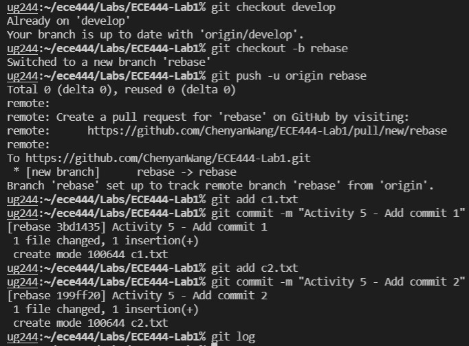
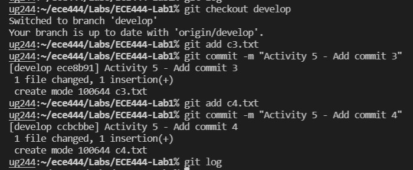

## Chenyan Wang

### Activity 5 Rebase Instructions  

Make rebase branch and make commits 1 and 2:  
  

Git log after commit 1 and 2 on rebase branch:  
  

Git checkout develop branch and make commits 3 and 4:  
  

Git log after commit 3 and 4 on develop branch:  
  

Git rebase onto develop branch (current branch is still develop):  
  

Git log after git rebase onto develop branch:  
  

Git rebase to reorder commits:  
  

Pre re-ordering changes:
  

Post re-ordering changes:
  

Git log post reordering commits using git rebase:  
  

